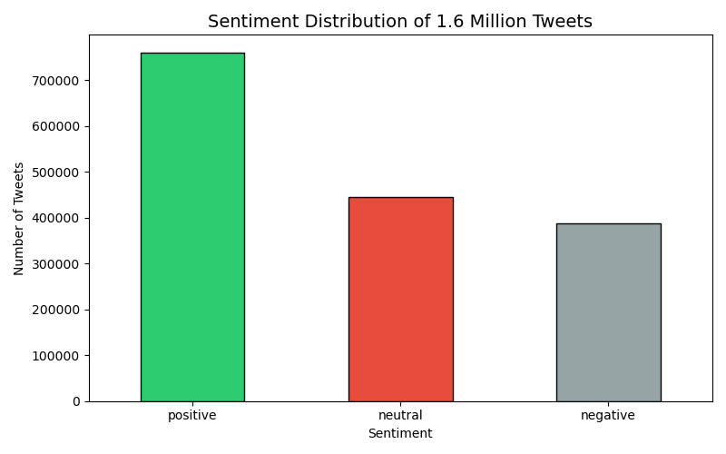
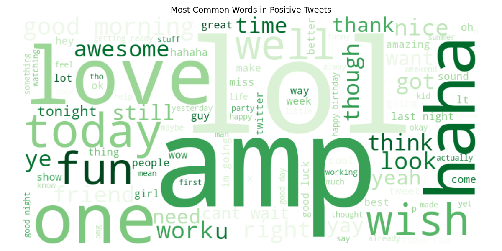
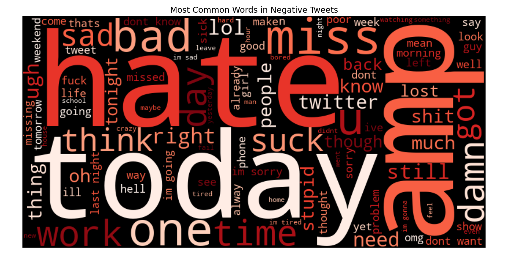
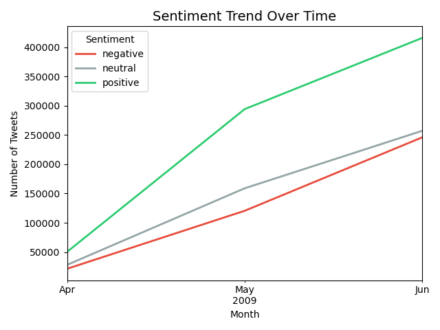

# Twitter Sentiment Analysis

Analyzed **1,592,484 tweets** using Python and VADER to 
understand public sentiment on Twitter.

## Tools Used
Python · Pandas · NLTK · VADER · Matplotlib · WordCloud

## Dataset
Sentiment140 — 1.6 million tweets (Kaggle)

## Results
| Sentiment | Count | Percentage |
|---|---|---|
| Positive | 760,450 | 47.8% |
| Neutral | 444,152 | 27.9% |
| Negative | 387,882 | 24.4% |

## Key Findings
- Nearly half of all tweets were positive
- Work stress and missing people drove most negative tweets
- Positive sentiment grew fastest from April to June 2009
- Social life and happiness drove most positive tweets

## Charts

